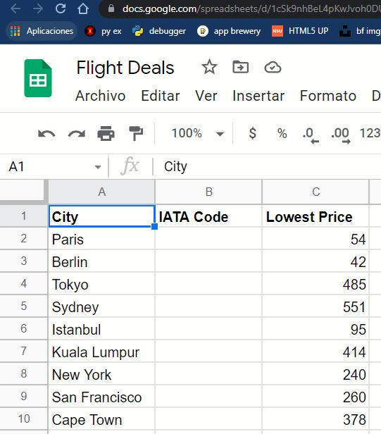
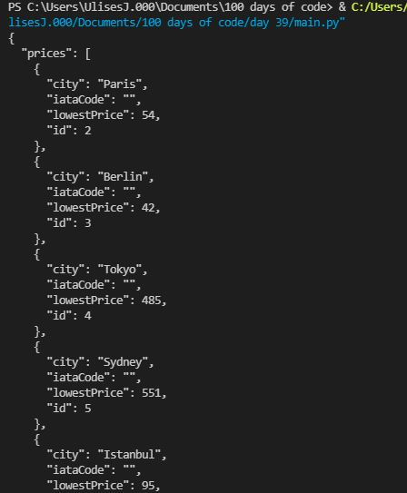
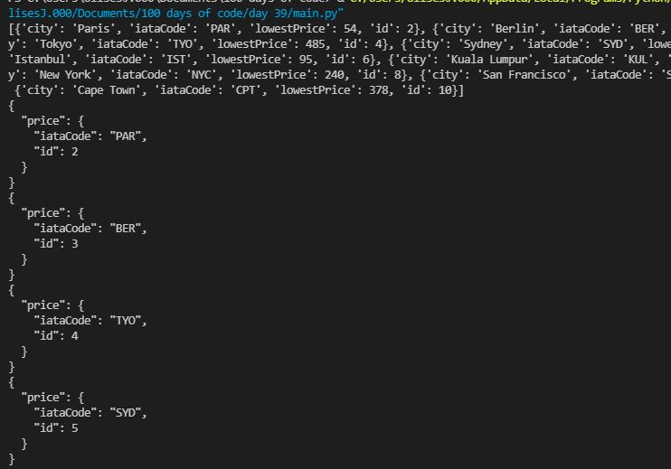
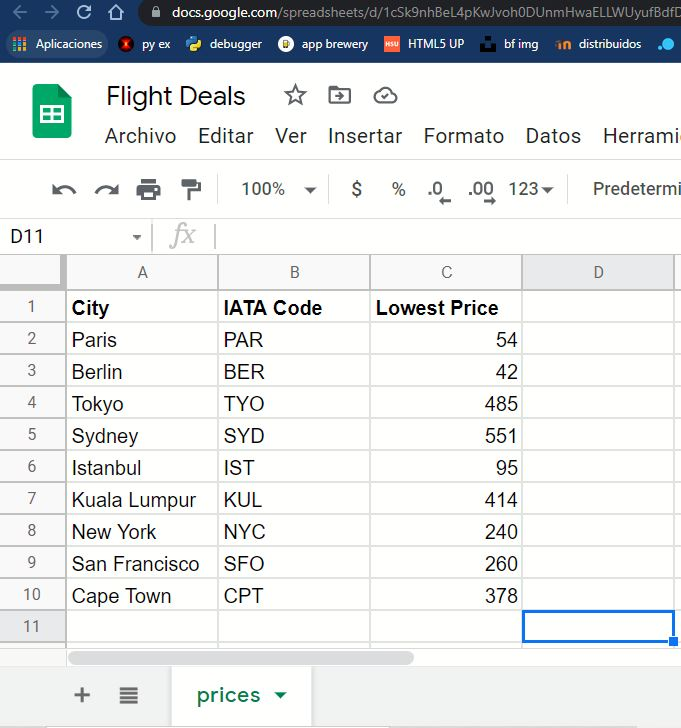
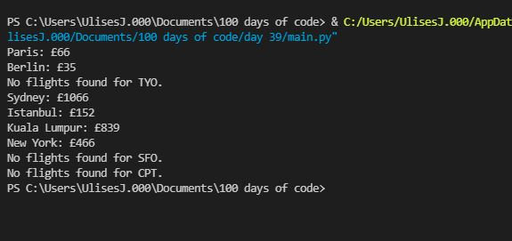
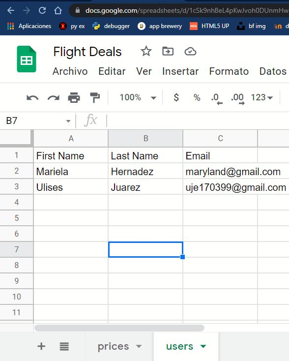
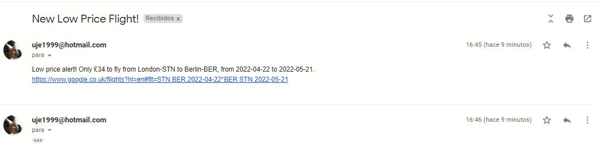

# Flight deal finder

Conectamos nuestra hoja de excel en google drive, con la api de sheety

Conectamos con la hoja gracia a sheety en python y vemos su contenido

Con ayuda de la API tequila obtenemos los iataCode de las ciudades que tenemos en nuestro excel, los preparamos en un archivo json.

Los insertamos via put en nuestro excel, ahora luce así. 

Con ayuda de la API tequila y gracias al código de las ciudades obtenemos los precios a cada una de la ciudades que tenemos en el excel partiendo de Londres. Comparamos los precios en los proximos 6 meses a esas ciudades.

Nos notificamos via SMS con ayuda de twilio cuando se encuentre el menor precio.

Del mismo modo sí se desea se pueden agregar clientes que desean recibir la información vía correo. Tal y como se ve en la imagen se le pedirán los datos y se enviaran a el excel users.

Ahora comprobamos y observamos que se tienen esos datos en la hoja de excel

Finalmente tambien enviamos las ofertas via email

